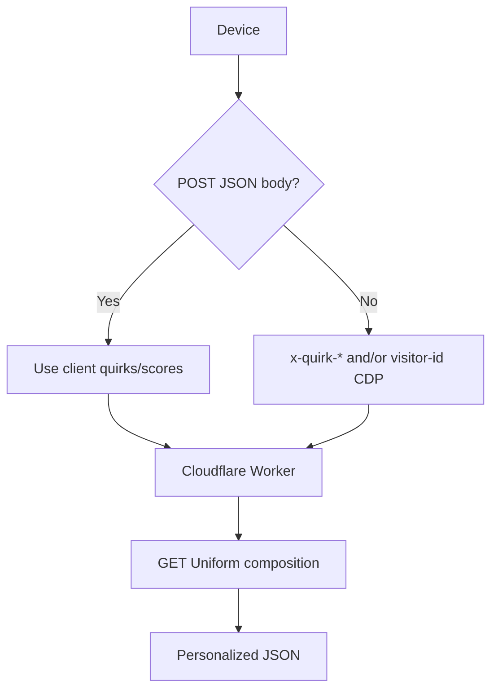
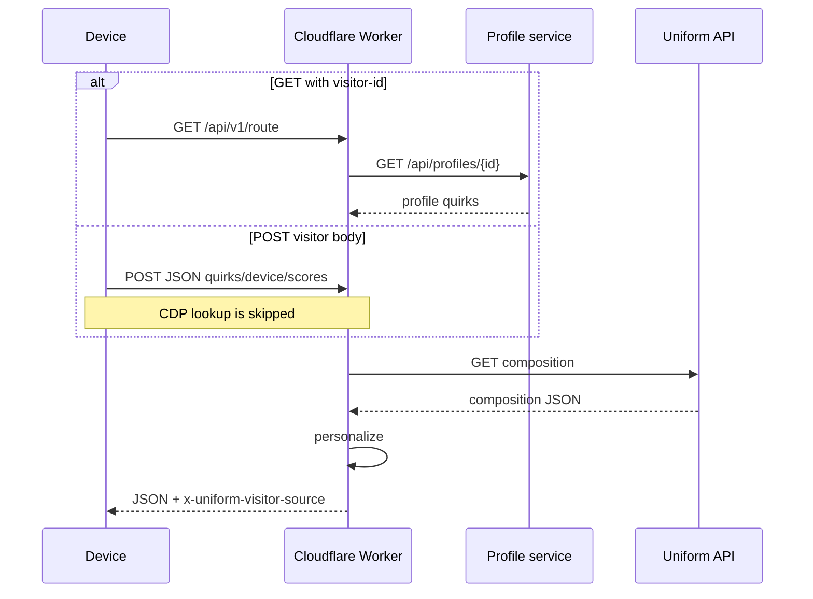

# Context as a Service -- Cloudflare Workers

A Cloudflare Worker that acts as a BFF for server-side Uniform Context personalization. Runs on Cloudflare's global edge network with near-zero cold starts.

## How it works

A single `fetch` handler receives all requests, resolves personalization and A/B tests against Uniform's Route API, and returns a clean composition.

1. On **GET**, reads `visitor-id` and/or `x-quirk-*` headers. `visitor-id` fetches the mock CDP profile to build quirks.
2. On **POST**, this Worker's `src/visitorPayload.ts` parser reads the JSON body and skips CDP lookup. Replace that file with your own payload contract.
3. **GET**s the Uniform Route API with `projectId` and `x-api-key` (cacheable). The personalized response is not cached.
4. Walks the composition tree to resolve personalization and A/B test nodes.
5. Strips SDK metadata and returns the processed composition with `x-uniform-visitor-source`.





## Project structure

```
cloudflare-worker/
+-- src/
|   +-- index.ts                Worker entry point
|   +-- visitorPayload.ts       This Worker's POST body parser (replaceable)
|   +-- context-manifest.json   Uniform Context manifest
+-- wrangler.toml               Wrangler config (gitignored)
+-- wrangler.toml.example       Template config
+-- .env.example                Local dev env vars
+-- package.json
```

## Setup

### 1. Install dependencies

```bash
npm install
```

### 2. Configure environment

```bash
cp .env.example .env
cp wrangler.toml.example wrangler.toml
```

Set `UNIFORM_API_KEY` and `UNIFORM_PROJECT_ID` in both files.

### 3. Download the context manifest

```bash
npm run uniform:manifest
```

### 4. Run locally

```bash
npm run dev
```

Worker starts at `http://localhost:8787`.

## API

### `GET /api/v1/route?path=<page-path>`

All query parameters are forwarded to the Uniform Route API.

**Headers:**

| Header       | Required | Description                           |
|--------------|----------|---------------------------------------|
| `visitor-id` | No       | Visitor identifier for profile lookup |
| `x-quirk-*`  | No       | Injected quirks (merged with CDP)     |

```bash
curl "http://localhost:8787/api/v1/route?path=/" \
  -H "visitor-id: 123"
```

### `POST /api/v1/route?path=<page-path>`

Send visitor data in the body instead of injecting a CDP profile. Body max **2000** characters.

```bash
curl -X POST "http://localhost:8787/api/v1/route?path=/" \
  -H "Content-Type: application/json" \
  -d '{"quirks":{"audience":"golf","hasReservation":"false"},"device":{"os":"ios"}}'
```

## Environment variables

Configured via `wrangler.toml` `[vars]` section or Wrangler secrets for production.

| Variable                    | Required | Default                        | Description                          |
|-----------------------------|----------|--------------------------------|--------------------------------------|
| `UNIFORM_API_KEY`           | Yes      | --                             | Uniform Canvas Route API key         |
| `UNIFORM_PROJECT_ID`        | Yes      | --                             | Uniform project identifier           |
| `UNIFORM_CLI_BASE_EDGE_URL` | No      | `https://uniform.global`       | Override Uniform API base URL        |
| `PROFILE_SERVICE_URL`       | No      | `https://cdpmock.vercel.app`   | Override mock profile service URL    |

## Deployment

```bash
npm run deploy
```

Ensure credentials are configured as Wrangler secrets (recommended) or `[vars]` before deploying:

```bash
wrangler secret put UNIFORM_API_KEY
wrangler secret put UNIFORM_PROJECT_ID
```

## Scripts

| Script | Description |
|--------|-------------|
| `npm run dev` | Local dev server via Wrangler |
| `npm run deploy` | Deploy to Cloudflare |
| `npm test` | Run tests (Vitest) |
| `npm run uniform:manifest` | Download context manifest from Uniform |
