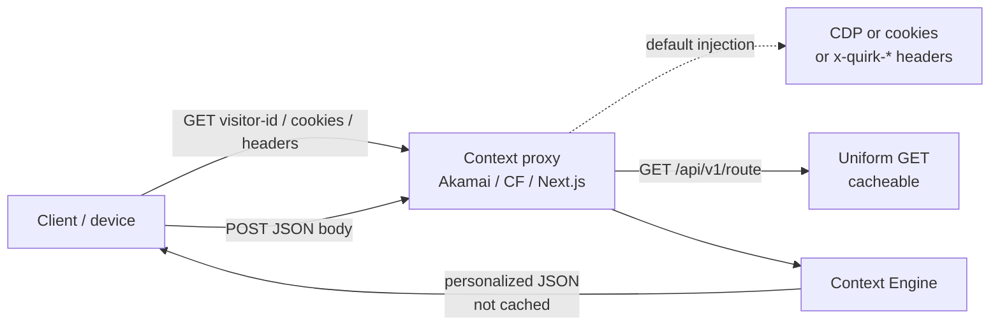
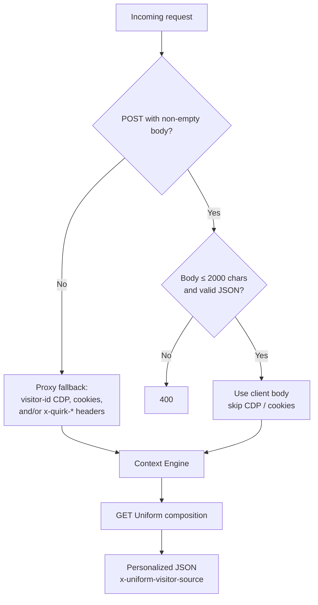

# Uniform Context as a Service

Server-side personalization powered by [Uniform](https://uniform.dev). This project moves personalization logic out of the frontend and into a lightweight server/edge function that acts as a proxy, resolving personalized content variants and A/B tests before the response reaches the client.

This pattern is recommended for **mobile apps**, **non-JavaScript runtimes**, and any architecture where client-side personalization is undesirable (layout shifts, SDK bundle size, flicker).

## How it works



1. The client sends either:
   - **GET** with injected identity (`visitor-id` CDP lookup, `ufvd` cookies, and/or `x-quirk-*` headers), or
   - **POST** with a JSON body containing quirks, device, scores, tests, enrichments, and events (skips CDP/cookie injection).
2. On GET, the service looks up the visitor's profile or cookies to build **quirks** -- key-value pairs like `audience`, `geoAudience`, and `hasReservation`.
3. It **GET**s the page composition from Uniform's Route API (this subrequest can be cached).
4. Using the **context manifest** and the visitor's quirks, it walks the composition tree and:
   - Resolves **personalization** nodes to the best-matching variant
   - Picks an **A/B test** variant
   - Strips resolution metadata (`$pzCrit`, `$tstVrnt`, `pz`, `control`, `id`) from the output
5. Returns the fully resolved, clean composition as JSON. The personalized response is not cached.



## Repository structure

This is a **pnpm + Turborepo** monorepo.

```
context-as-a-service/
│
├── packages/
│   └── context-engine/          Shared composition processing library
│
├── proxies/
│   ├── nextjs-api/              Next.js implementation (API route + Vercel Edge middleware)
│   ├── cloudflare-worker/       Cloudflare Workers implementation
│   └── akamai-edgeworker/       Akamai EdgeWorkers implementation
│
├── examples/
│   ├── sample-content/          Sample Uniform project content for demos
│   ├── mock-profile-service/    Mock CDP/profile API for demo visitor data
│   └── console-client/          Minimal Node.js client for smoke-testing
│
├── turbo.json                   Turborepo pipeline configuration
├── pnpm-workspace.yaml          Workspace definition
└── readme.md                    This file
```

## Getting started

```bash
# Install all dependencies from root
pnpm install

# Build all projects
pnpm build

# Run tests
pnpm test
```

### Using sample content

To try this project with pre-built sample compositions, push the included content to your Uniform project:

```bash
cd examples/sample-content
# Set UNIFORM_API_KEY and UNIFORM_PROJECT_ID in .env
pnpm uniform:push
```

This pushes sample compositions, personalization signals, and A/B tests to your Uniform project. You can then pull the context manifest and run any proxy against it.

### Running a proxy

```bash
# Pull the context manifest (required before first run)
pnpm --filter @uniformdev/context-service-nextjs pull:manifest

# Run in dev mode
pnpm --filter @uniformdev/context-service-nextjs dev
pnpm --filter @uniformdev/context-service-cloudflare dev
```

## Packages

### [`packages/context-engine`](packages/context-engine/)

Shared library (`@uniformdev/context-engine`) that all proxies depend on. Provides:

- **`processComposition()`** -- walks a Uniform composition tree and resolves personalization and A/B test nodes in-place, then strips SDK metadata
- **`stripResolvedMetadata()`** -- recursively removes resolution metadata (`$pzCrit`, `$tstVrnt`, `pz`, `control`, `id`, `testDistribution`) from all nodes

The library accepts a manifest and optional context options (e.g. `CookieTransitionDataStore`), keeping it runtime-agnostic. Each proxy only handles its platform-specific concerns (HTTP, env vars, and **its own visitor-body parser**). POST payload shape is not part of this package — customers replace the per-proxy parser with their own contract.

## Proxy implementations

### [Next.js (`proxies/nextjs-api/`)](proxies/nextjs-api/)

Two execution modes in a single Next.js app:

- **API Route** (Node.js runtime) -- for self-hosted deployments on Azure, Docker, AWS, etc.
- **Vercel Edge Middleware** -- for edge execution on Vercel, toggled via `ENABLE_EDGE_MIDDLEWARE=true`

**Start here** -- this is the most complete implementation.

See [`proxies/nextjs-api/README.md`](proxies/nextjs-api/README.md) for full documentation.

### [Cloudflare Workers (`proxies/cloudflare-worker/`)](proxies/cloudflare-worker/)

A single-file Cloudflare Worker using Wrangler for local dev and deployment. Lightweight, runs on Cloudflare's global edge network.

See [`proxies/cloudflare-worker/README.md`](proxies/cloudflare-worker/README.md) for full documentation.

### [Akamai EdgeWorkers (`proxies/akamai-edgeworker/`)](proxies/akamai-edgeworker/)

An Akamai EdgeWorker using `httpRequest` and `createResponse` APIs, bundled with Rollup. Supports Akamai's sandbox environment for local testing and the Akamai CLI for deployment.

This proxy also demonstrates **cookie-based transition data** via `CookieTransitionDataStore` for persistent visitor context across requests, and **header-based quirks** (`x-quirk-*` headers) as an alternative to CDP profile lookup.

See [`proxies/akamai-edgeworker/README.md`](proxies/akamai-edgeworker/README.md) for full documentation.

## Examples

### [Sample Content (`examples/sample-content/`)](examples/sample-content/)

Pre-built Uniform project content (compositions, signals, tests) that can be pushed to your Uniform project with `pnpm uniform:push`. Use this to get a working demo without manually creating content in the Uniform dashboard.

### [Mock Profile Service (`examples/mock-profile-service/`)](examples/mock-profile-service/)

A Next.js app that serves as a **mock CDP (Customer Data Platform)** for demos. It provides a REST API at `/api/profiles/{id}` that returns visitor profile data including audience segment, geographic proximity, reservation status, and membership level.

The profile data drives the **quirks** that the context service uses for personalization decisions. In production, this would be replaced by a real CDP, CRM, or identity service.

See [`examples/mock-profile-service/README.md`](examples/mock-profile-service/README.md) for the profile data schema and available test visitors.

### [Console Client (`examples/console-client/`)](examples/console-client/)

A minimal Node.js script for smoke-testing any of the proxy services. It sends a request with a `visitor-id` header and logs the resolved page title from the composition response.

See [`examples/console-client/README.md`](examples/console-client/README.md) for usage.

## Shared API contract

All proxies expose the same API.

### `GET /api/v1/route?path=<page-path>`

Proxies to Uniform's Route API with server-side personalization applied. All query parameters are passed through to the Uniform API.

**Headers:**

| Header        | Required | Description |
|---------------|----------|-------------|
| `visitor-id`  | No       | Visitor identifier for CDP profile lookup (Next.js / Cloudflare) |
| `x-quirk-*`   | No       | Injected quirks (all proxies) |
| `Cookie`      | No       | `ufvd` / `ufvdqk` transition cookies (Akamai) |

### `POST /api/v1/route?path=<page-path>`

Same Uniform GET under the hood, but visitor identity comes from the JSON body instead of CDP/cookie injection. **Each proxy has its own parser** (`visitorPayload.ts`) — replace it with your payload contract. Demo body max **2000** characters.

```json
{
  "quirks": { "audience": "golf" },
  "device": { "os": "ios", "type": "phone" },
  "scores": { "launchCampaign": 10 },
  "tests": { "homeScreenHeroTest": "variant" },
  "enrichments": [{ "cat": "audience", "key": "golf", "str": 10 }],
  "events": [{ "event": "app_open" }]
}
```

An empty POST body falls back to the GET injection path. A non-empty POST body is the source of truth. Successful responses include `x-uniform-visitor-source`: `client-body`, `cdp`, `cookies`, or `headers`.

**Examples:**

```bash
curl "http://localhost:3000/api/v1/route?path=/" \
  -H "visitor-id: 123"

curl -X POST "http://localhost:3000/api/v1/route?path=/" \
  -H "Content-Type: application/json" \
  -d '{"quirks":{"audience":"golf","hasReservation":"false"},"device":{"os":"ios"}}'
```

## Prerequisites

- Node.js 18+
- pnpm
- A [Uniform](https://uniform.dev) project with Canvas compositions
- Platform-specific CLI tools (Wrangler for Cloudflare, Akamai CLI for EdgeWorkers, etc.)

## Environment variables

All proxies require:

| Variable                   | Required | Description                                      |
|----------------------------|----------|--------------------------------------------------|
| `UNIFORM_API_KEY`          | Yes      | API key for the Uniform Canvas Route API         |
| `UNIFORM_PROJECT_ID`       | Yes      | Uniform project identifier                       |
| `UNIFORM_CLI_BASE_EDGE_URL`| No      | Override Uniform API base URL (default: `https://uniform.global`) |
| `PROFILE_SERVICE_URL`      | No      | Override mock profile service URL (default: `https://cdpmock.vercel.app`) |

Additional proxy-specific variables are documented in each proxy's README.

## Tech stack

- **Monorepo:** pnpm workspaces + [Turborepo](https://turbo.build)
- **Shared library:** [`@uniformdev/context-engine`](packages/context-engine/) -- composition processing, personalization resolution, metadata stripping
- **Personalization:** [Uniform Context](https://docs.uniform.app/docs/context) + [Canvas](https://docs.uniform.app/docs/canvas) (`@uniformdev/context`, `@uniformdev/canvas`)
- **Language:** TypeScript
- **Runtimes:** Node.js, Cloudflare Workers (V8), Akamai EdgeWorkers, Vercel Edge
